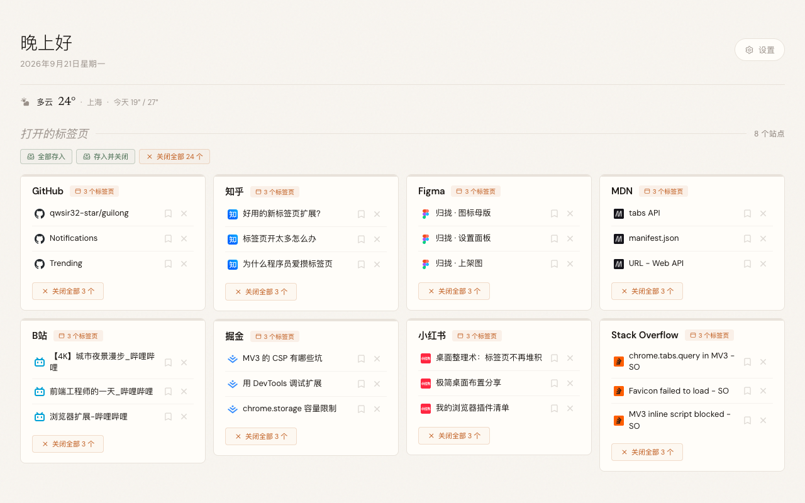
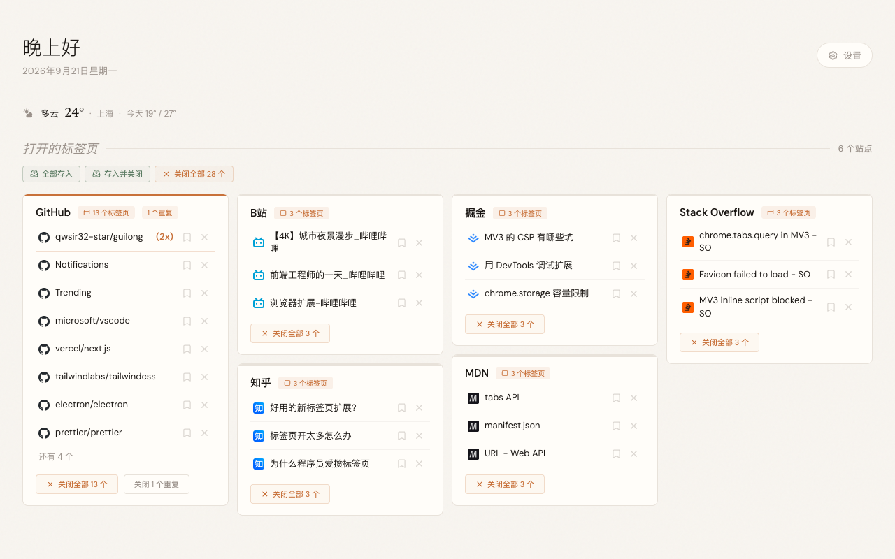

<p align="center">
  
</p>

<h1 align="center">归拢</h1>

<p align="center"><strong>一个简洁的可视化管理你的打开标签页的浏览器插件</strong></p>

<p align="center">
  按域名把你开着的标签页归拢成一张面板，整组一次关干净，没看完的先存起来。<br>
  Chrome / Edge / Firefox 扩展，无服务器、不收集数据。
</p>

<p align="center">
  <a href="LICENSE"></a>
  
</p>

---

散着的标签页，归拢一下。

它接管你的新标签页，换成一张网格图：此刻开着的标签页按域名收进一卡一卡，摊开摆在你面前。哪个站开了多少个、哪些其实开重了、哪些只是先放着回头再看，扫一眼就明白，不用再一个标签一个标签地翻。

- 找东西不用一个个点过去，它们都在那儿摊着
- 整组一起关掉，手起刀落
- 舍不得关的先存着，回头处理完归档，哪天想起来还能翻出来

顺眼的留着，不顺眼的关掉。常用站点条、搜索框、天气都能单独关，主题色八套，中英双语。

<p align="center">
  
</p>

## 目录

- [为什么做这个](#为什么做这个)
- [功能](#功能)
- [安装](#安装)
- [浏览器支持](#浏览器支持)
- [设置](#设置)
- [常见问题](#常见问题)
- [更多文档](#更多文档)
- [参与](#参与)
- [致谢](#致谢)
- [许可证](#许可证)

## 为什么做这个

标签页开着开着就多了，然后就开始难受。

想找的那个混在几十个里，只好一个个点过去。明知道一半用不上了，也不敢关，万一等会儿还要看呢。资料查到一半，浏览器就不能关，关掉等于丢掉。

归拢就是为这三件事写的。摊开看清，整组关掉，关之前先存下来。

## 功能

| 功能 | 说明 |
|---|---|
| 按域名分组 | 同一个站的收进一张卡（子域一起算），网格排开 |
| 重复检测 | 同一个页面开了两遍会被标出来，一键清掉，只留一份 |
| 点标题就跳 | 点标题直接跳过去，跨窗口也行，不多开一个 |
| 关整组问两次 | 「关闭全部 N 个」第一次点是在问你，5 秒内再点一次才真关，防手滑 |
| 稍后再看 | 关之前先存着，处理完归档，之后还能搜回来、还原回来 |
| 常用站点条 | 常去的钉在顶部，按住能拖着排序，一点就到（可关） |
| 搜索框 | 输入网址直接开，否则交给你自己设的搜索引擎（可关） |
| 当地天气 | 图标、气温、城市、今天的最高最低，一行放下（可关） |
| 主题色 | 八套，含跟随系统 |
| 呼出快捷键 | 默认 `⌘⇧K` / `Ctrl+Shift+K`，设置里能看到当前绑定 |
| 工具栏图标 | 点一下把面板叫出来，角标显示标签页数 |
| 中英双语 | 默认跟随系统 |

<p align="center">
  
</p>

<p align="center"><sub>同一个站开得太多会折叠起来；开重了的会被标出来，一键只留一份</sub></p>

**不做什么**：不做同步，没有账号，换台电脑要重新钉一遍；不整理浏览历史，只管你此刻开着的那些；也不是书签管理器的替代品，「稍后再看」是给没看完的标签页用的临时清单。

## 安装

### 从打包好的 zip 装（最省事）

到 [Releases](https://github.com/qwsir32-star/guilong/releases) 下载对应浏览器的 zip，解压，然后：

- **Chrome / Edge**：打开 `chrome://extensions`（Edge 是 `edge://extensions`），右上角打开「开发者模式」，点「加载已解压的扩展程序」，选解压出来的那个文件夹。
- **Firefox**：Firefox 不给未签名的扩展长期安装，zip 要签名才能装，见 [Firefox 安装指南](docs/firefox-安装指南.md)。

### 从源码装

```bash
git clone https://github.com/qwsir32-star/guilong.git
```

- **Chrome / Edge**：同上，只不过选的是仓库里的 `extension/` 文件夹。
- **Firefox**：同上，先看 [Firefox 安装指南](docs/firefox-安装指南.md)。

装完打开一个新标签页，看到的就是归拢。

要自己打包或者跑测试：

```bash
node tools/build-store.js          # 打成三个可分发的 zip（chrome / edge / firefox）
node tests/smoke.js                # 冒烟测试 + 静态守卫，零依赖，跑完 0.2 秒
node tests/mutations/run-all.js    # 变异测试：证明每条守卫坏掉时真的会变红（十几分钟）
```

> 「全新安装」和「图标有没有偷偷联网」另有两个脚本，要真机跑，见
> [工程笔记](docs/工程笔记.md#另外三件必须真跑平时不跑)。

## 浏览器支持

| | 版本 |
|---|---|
| Chrome | 88 及以上（Manifest V3） |
| Edge | 88 及以上，跟 Chrome 共用同一个包 |
| Firefox | 142.0 及以上 |

## 设置

齿轮在页头右上角。所有开关都只管显示，不删数据。

| 设置 | 默认 | 说明 |
|---|---|---|
| 常用站点条 | 关 | 关掉只是不显示，钉过的站点一条不丢 |
| 搜索框 | 关 | 同上 |
| 当地天气 | 开 | 关掉之后它就不出门了 |
| 主题色 | 纸感 | 纸感 / 浅色 / 浅绿 / 浅蓝 / 深色 / 松林 / 墨蓝 / 跟随系统 |
| 界面语言 | 跟随系统 | 中文 / 英文 / 跟随系统 |
| 呼出快捷键 | `⌘⇧K` / `Ctrl+Shift+K` | 只能看当前绑定，改要去浏览器自己的快捷键页面（Firefox 上是 `Ctrl+Shift+L`） |

## 常见问题

<details>
<summary>关掉某个开关，我钉住的站点会不会丢？</summary>

不会。开关只管显示，一条数据都不删。关掉再打开，原样还在。
</details>

<details>
<summary>Mac 和 Windows 上长得一样吗？</summary>

拉丁字母和数字一样，字体随扩展打包，两个系统用的是同一份。汉字各用各系统自己的字体（Mac 上苹方，Windows 上微软雅黑），这样两边都落在自己最好看的那个上，而不是回退出来的那个。
</details>

<details>
<summary>点站点条，为什么不跳到已经开着的那一个？</summary>

故意的。站点条回答的是「我要去这儿」，所以永远新开一个。要找已经开着的那一个，看上面的标签页网格。
</details>

<details>
<summary>「稍后再看」和书签有什么区别？</summary>

书签是长期的。「稍后再看」是给手头没看完的标签页用的：先存着，处理完归档，想起来了还能搜回来。它存在扩展自己的本地存储里，不动你的浏览器书签。
</details>

<details>
<summary>为什么 Firefox 上有些站点只有首字母色块？</summary>

Chrome 和 Edge 上图标读的是浏览器自己缓存的本地图标，Firefox 没有这个本地接口。归拢没有为了补一张图去站点服务器下载。
</details>

## 更多文档

- [天气：数据从哪来，以及它为什么不问你要权限](docs/天气.md)
- [快捷键：为什么只能「显示」，改要去浏览器自己的页面](docs/快捷键.md)
- [Firefox 安装指南](docs/firefox-安装指南.md)
- [隐私声明](./PRIVACY.md)

## 参与

Issue 和 PR 都欢迎。小改动直接提，大的先开个 issue 聊两句。

改完跑一次冒烟测试，零依赖，0.2 秒：

```bash
node tests/smoke.js
```

界面文案全在 `extension/strings.js` 一张表里，中英各一份。改文案只改那张表，别往 `app.js` 里写死字符串。引擎细节和各种技术取舍见[工程笔记](docs/工程笔记.md)。

## 致谢

归拢站在 [Tab Out](https://github.com/zarazhangrui/tab-out) 的肩膀上。按域名分组的思路、关闭时的音效和彩带、「稍后再看」这份清单，这些骨架都是原作者 Zara 的。

## 许可证

MIT。原始版权归 [Zara Zhang](https://x.com/zarazhangrui)，衍生部分的版权归本项目作者，两份声明都保留在 [LICENSE](./LICENSE) 中。
